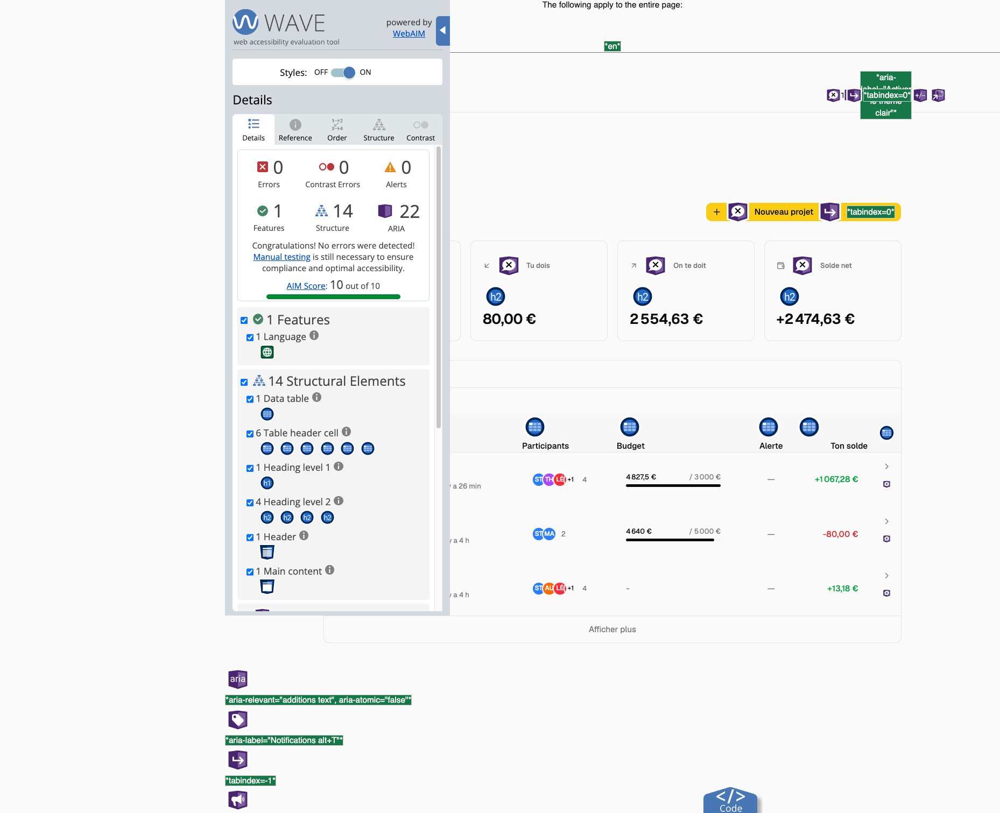

# Audit d'accessibilité de la HomePage

## Outil utilisé

L'audit a été réalisé à l'aide de l'extension **WAVE Web Accessibility Evaluation Tools** :

https://wave.webaim.org/extension/

## Corrections réalisées

### Boutons contenant uniquement une icône

- Ajout d'attributs `aria-label` sur les boutons d'action.
- Suppression des avertissements liés aux boutons sans texte accessible.

### En-têtes de tableaux

- Ajout de libellés accessibles via la classe `sr-only` pour les colonnes d'actions.
- Correction des avertissements liés aux cellules `<th>` vides.

### Structure sémantique

- Vérification de la hiérarchie des titres présents sur la page.
- Correction des éléments pouvant être interprétés comme des titres sans utiliser de balises adaptées.

